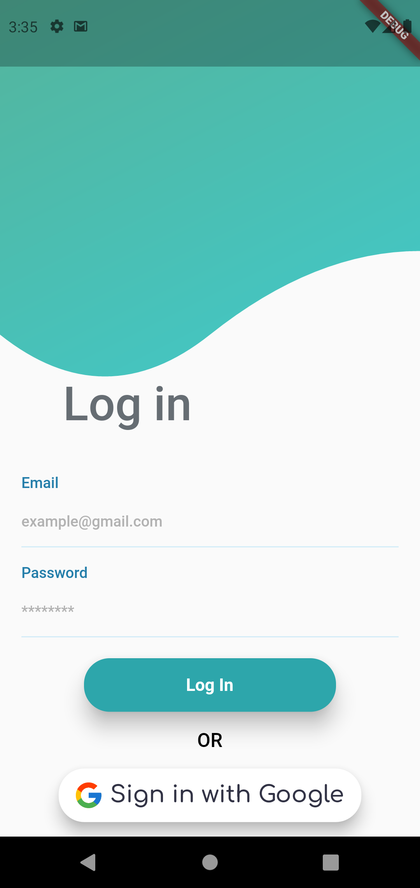
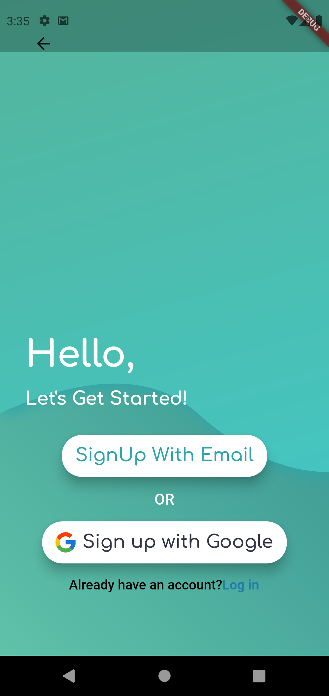
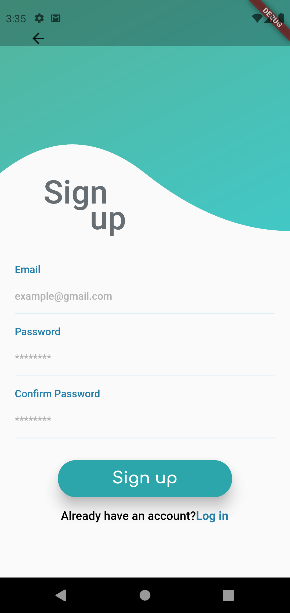
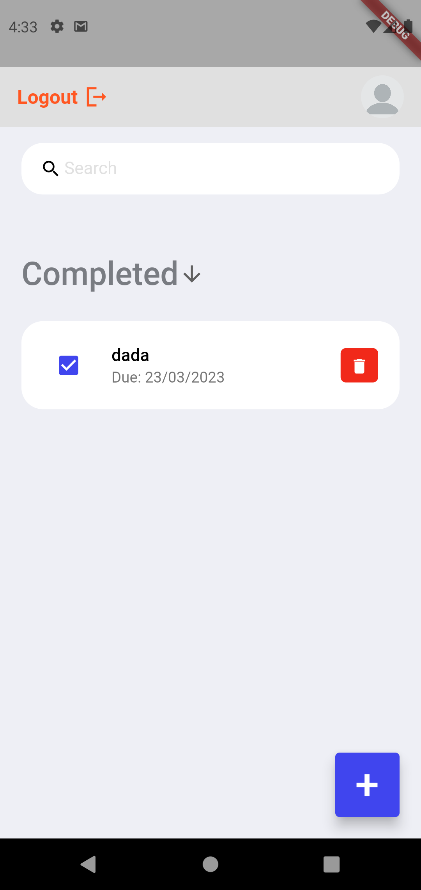
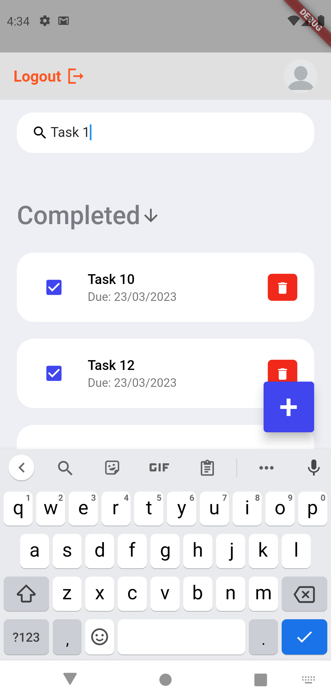
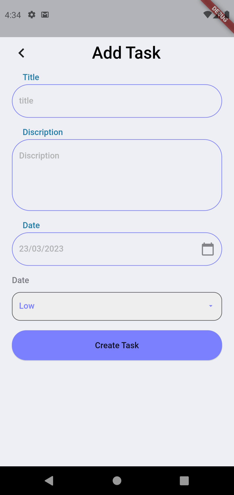

# Task App

This is a Task app built using Firebase and GetX state management.

## Features

- Create tasks
- Mark tasks as completed
- Delete tasks
- Search tasks
- See completed tasks
- Sign in with email and password
- Sign in with Google

## Technology Stack

- Flutter
- Firebase Authentication
- Cloud Firestore
- GetX State Management

## Requirements

- Flutter SDK
- Firebase project with Authentication and Cloud Firestore enabled
- Google Sign-In API Key (if using Google sign-in)

## Setup

1. Clone this repository
2. Create a Firebase project and enable Authentication and Cloud Firestore
3. Add the fingerprint to your Firebase project (if using Google sign-in)
4. Copy the `google-services.json` file to the `android/app` directory (Android only)
5. Run `flutter pub get` to install dependencies
6. Run the app using `flutter run`

## Screenshots

<!--   -->

  
   
   

  
   
   

## How to Use

1. Sign in with your email and password or Google account.
2. Add new tasks by clicking on the "+" button.
3. Mark tasks as completed by clicking on the checkbox next to the task.
4. Delete tasks by delete icon.
5. Search for tasks using the search bar at the top of the screen.
6. View completed tasks by clicking on the "Completed" in drop downS.

## License

This project is licensed under the MIT License. See the [LICENSE](LICENSE) file for details.
